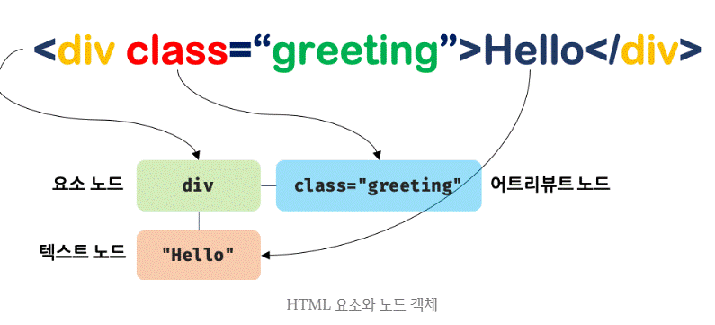
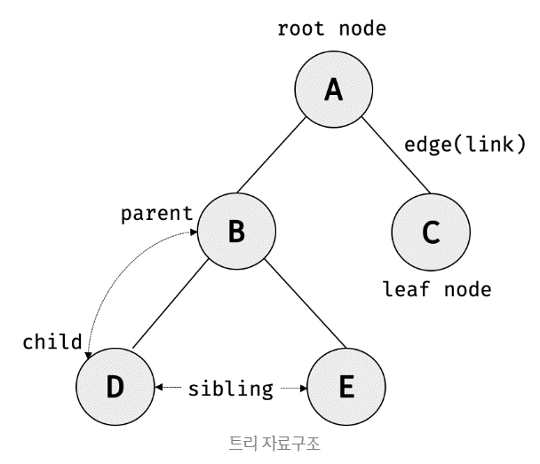
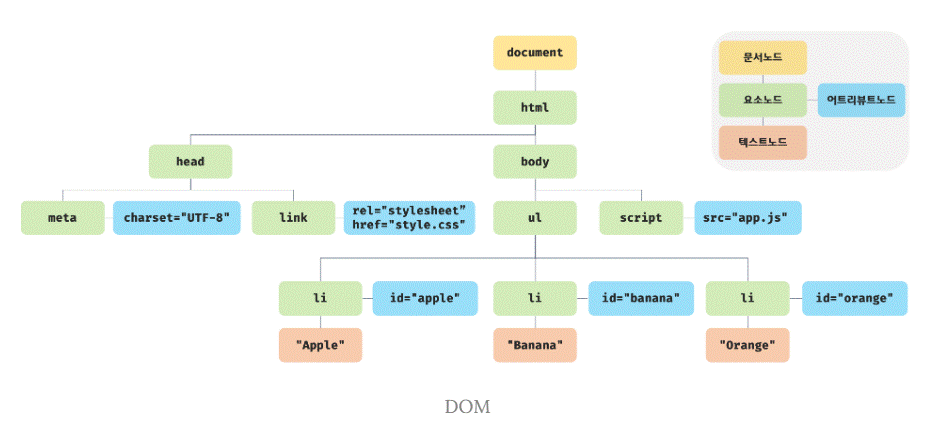
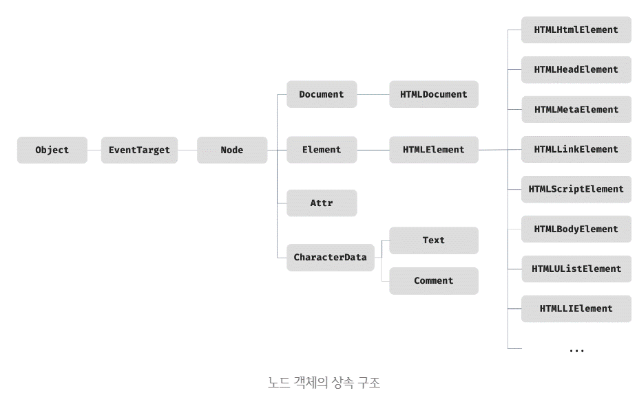
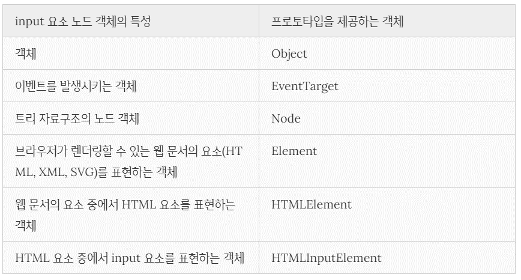

# DOM - 1

<br>

**DOM(Document Object Model)은 HTML 문서의 계층적 구조와 정보를 표현하며 이를 제어할 수 있는 API, 즉 프로퍼티와 메서드를 제공하는 트리 자료구조이다.**

<br>

# 1. 노드

<br>

## 1.1 HTML 요소와 노드 객체

<br>

HTML 요소(HTML element)는 HTML 문서를 구성하는 개별적인 요소를 의미한다.

<br>


<br>

HTML 요소는 렌더링 엔진에 의해 파싱되어 DOM을 구성하는 요소 노드 객체로 변환된다.

이때 HTML 요소의 어트리뷰트는 어트리뷰트 노드로, HTML 요소의 텍스트 콘텐츠는 텍스트 노드로 변환된다.

<br>



<br>

HTML 문서는 HTML 요소들의 집합으로 이뤄지며, HTML 요소는 중첩 관계를 갖는다. 

즉, HTML 요소의 콘텐츠 영역(시작 태그와 종료 태그 사이)에는 텍스트뿐만 아니라 다른 HTML 요소도 포함할 수 있다.

<br>

이때 HTML 요소 간에는 중첩 관계에 의해 계층적인 부자(parent-child) 관계가 형성된다. 

이러한 HTML 요소 간의 부자 관계를 반영하여 HTML 문서의 구성 요소인 HTML 요소를 객체화한 모든 노드 객체들을 트리 자료구조로 구성한다.

<br>



<br>

**노드 객체들로 구성된 트리 자료구조를 DOM(Document Object Model)이라 한다.** 

노드 객체의 트리로 구조화되어 있기 때문에 DOM을 **DOM** **트리**라고 부르기도 한다.

<br>

## 1.2. 노드 객체의 타입

<br>

```jsx
<!DOCTYPE html>
<html>
  <head>
    <meta charset="UTF-8">
    <link rel="stylesheet" href="style.css">
  </head>
  <body>
    <ul>
      <li id="apple">Apple</li>
      <li id="banana">Banana</li>
      <li id="orange">Orange</li>
    </ul>
    <script src="app.js"></script>
  </body>
</html>
```

<br>

랜더링 엔진이 생성한 DOM 트리

<br>



<br>

이처럼 DOM은 노드 객체의 계층적인 구조로 구성된다.

노드 객체는 종류가 있고 상속 구조를 갖는다. 

노드 객체는 총 12개의 종류(노드 타입)가 있다. 

이 중에서 중요한 노드 타입은 다음과 같이 4가지다.

<br>

**1 . 문서 노드**

문서 노드(document node)는 DOM 트리의 최상위에 존재하는 루트 노드로서 document 객체를 가리킨다.

HTML 문서 전체를 가리키는 객체로서 전역 객체 window의 document 프로퍼티에 바인딩되어 있다.

따라서 문서 노드는 window.document 또는 document로 참조할 수 있다.

<br>

모든 자바스크립트 코드는 전역 객체 window의 document 프로퍼티에 바인딩되어 있는 하나의 document 객체를 바라본다.

<br>

문서 노드, 즉 document 객체는 DOM 트리의 루트 노드이므로 DOM 트리의 노드들에 접근하기 위한 진입점(entry point) 역할을 담당한다.

즉, **요소, 어트리뷰트, 텍스트 노드에 접근하려면 문서 노드를 통해야 한다.**

<br>

**2 . 요소 노드**

요소 노드(element node)는 HTML 요소를 가리키는 객체다.

소 노드는 HTML 요소 간의 중첩에 의해 부자 관계를 가지며, 이 부자 관계를 통해 정보를 구조화한다.

따라서 **요소 노드는 문서의 구조를 표현한다고 할 수 있다.**

<br>

**3 . 어트리뷰트 노드**

어트리뷰트 노드(attribute node)는 HTML 요소의 어트리뷰트를 가리키는 객체다. 

어트리뷰트 노드는 어트리뷰트가 지정된 HTML 요소의 요소 노드와 형제(sibling) 관계를 갖는다.

단, 요소 노드는 부모 노드와 연결되어 있지만 어트리뷰트 노드는 부모 노드와 연결되어 있지 않고 형제 노드인 요소 노드에만 연결되어 있다.

**따라서 어트리뷰트 노드에 접근하여 어트리뷰트를 참조하거나 변경하려면 먼저 형제 노드인 요소 노드에 접근해야 한다.**

<br>

**4 . 텍스트 노드**

텍스트 노드(text node)는 HTML 요소의 텍스트를 가리키는 객체다. 

요소 노드가 문서의 구조를 표현한다면 텍스트 노드는 문서의 정보를 표현한다고 할 수 있다.

텍스트 노드는 요소 노드의 자식 노드이며, 자식 노드를 가질 수 없는 **리프 노드(leaf node)** 다.

<br>

텍스트 노드는 DOM 트리의 최종단이다. 

**따라서 텍스트 노드에 접근하려면 먼저 부모 노드인 요소 노드에 접근해야 한다.**

<br>

위 4가지 노드 타입 이외에도 총 12개의 노드 타입이 있다.

<br>

## 1.3. 노드 객체의 상속 구조

<br>

DOM을 구성하는 노드 객체는 자신의 구조와 정보를 제어할 수 있는 DOM API를 사용할 수 있다. 

이를 통해 노드 객체는 자신의 부모, 형제, 자식을 탐색할 수 있으며, 자신의 어트리뷰트와 텍스트를 조작할 수도 있다.

<br>

DOM을 구성하는 노드 객체는 ECMAScript 사양에 정의된 표준 빌트인 객체(standard built-in objects)가 아니라 브라우저 환경에서 추가적으로 제공하는 **호스트 객체(host objects)** 다. 

하지만 노드 객체도 자바스크립트 객체이므로 프로토타입에 의한 상속 구조를 갖는다.

<br>



<br>

모든 노드 객체는 Object, EventTarget, Node 인터페이스를 상속받는다.

<br>

추가로

**문서 노드** → Document, HTMLDocument 인터페이스를 상속받는다.

**어트리뷰트 노드** → Attr를 상속받는다.

**텍스트 노드** →CharacterData 인터페이스를 각각 상속받는다.

**요소 노드** → Element 인터페이스를 상속받는다.

<br>

또한 요소 노드는 추가적으로 HTMLElement와 태그의 종류별로 세분화된 HTMLHtmlElement, HTMLHeadElement, HTMLBodyElement, HTMLUListElement 등의 인터페이스를 상속받는다.

<br>

프로토타입 체인 관점에서 자신이 속해있는 

노드들의 프로토타입 체인에서 상속을 받는다.

<br>


<br>

```jsx
<!DOCTYPE html>
<html>
<body>
  <input type="text">
  <script>
    // input 요소 노드 객체를 선택
    const $input = document.querySelector('input');

    // input 요소 노드 객체의 프로토타입 체인
    console.log(
      Object.getPrototypeOf($input) === HTMLInputElement.prototype,
      Object.getPrototypeOf(HTMLInputElement.prototype) === HTMLElement.prototype,
      Object.getPrototypeOf(HTMLElement.prototype) === Element.prototype,
      Object.getPrototypeOf(Element.prototype) === Node.prototype,
      Object.getPrototypeOf(Node.prototype) === EventTarget.prototype,
      Object.getPrototypeOf(EventTarget.prototype) === Object.prototype
    ); // 모두 true
  </script>
</body>
</html>
```

<br>

input 요소 노드 객체도 다음과 같이 다양한 특성을 갖는 객체이며, 이러한 특성을 나타내는 기능들을 상속을 통해 제공받는다.

<br>



<br>

노드 객체에는 노드 객체의 종류, 즉 노드 타입에 상관없이 모든 노드 객체가 공통으로 갖는 기능도 있고, 노드 타입에 따라 고유한 기능도 있다.

예를 들어, 모든 노드 객체는 공통적으로 이벤트를 발생시킬 수 있다. **이벤트에** **관련된 기능**은 **EventTarget 인터페이스가 제공한다.**

모든 노드 객체는 트리 자료구조의 노드로서 공통적으로 **트리 탐색 기능**이나 노드 정보 제공 기능, 노드 관련 기능은 **Node 인터페이스가 제공한다.**

<br>

HTML 요소가 객체화된 요소 노드 객체는 HTML 요소가 갖는 공통적인 기능이 있다. 

예를 들어, input 요소 노드 객체와 div 요소 노드 객체는 모두 HTML 요소의 스타일을 나타내는 style 프로퍼티가 있다. 

이처럼 **HTML 요소가 갖는 공통적인 기능은 HTMLElement 인터페이스가 제공한다.**

<br>

이처럼 노드 객체는 공통된 기능일수록 프로토타입 체인의 상위에, 개별적인 고유 기능일수록 프로토타입 체인의 하위에 프로토타입 체인을 구축하여 노드 객체에 필요한 기능, 즉 프로퍼티와 메서드를 제공하는 상속 구조를 갖는다.

<br>

지금까지 살펴본 바와 같이 **DOM은 HTML 문서의 계층적 구조와 정보를 표현하는 것은 물론 노드 객체의 종류, 즉 노드 타입에 따라 필요한 기능을 프로퍼티와 메서드의 집합인 DOM API(Application Programming Interface)로 제공한다.** 

**이 DOM API를 통해 HTML의 구조나 내용 또는 스타일 등을 동적으로 조작할 수 있다.**

<br>

중요한 것은 DOM API, 즉 DOM이 제공하는 프로퍼티와 메서드를 사용하여 노드에 접근하고 HTML의 구조나 내용 또는 스타일 등을 동적으로 변경하는 방법을 익히는 것이다. 

**프런트엔드 개발자에게 HTML은 단순히 태그와 어트리뷰트를 선언적으로 배치하여 뷰를 구성하는 것 이상의 의미를 갖는다. 즉, HTML을 DOM과 연관 지어 바라보아야 한다.**

<br>

# 2. 요소 노드 취득

<br>

HTML의 구조나 내용 또는 스타일 등을 동적으로 조작하려면 먼저 요소 노드를 취득해야 한다.

**요소 노드의 취득은 HTML 요소를 조작하는 시작점이다. 이를 위해 DOM은 요소 노드를 취득할 수 있는 다양한 메서드를 제공한다.**

<br>

## 2.1. id를 이용한 요소 노드 취득

<br>

`Document.prototype.getElementById` 메서드는 인수로 전달한 id 어트리뷰트 값을 갖는 하나의 요소 노드를 탐색하여 반환한다.

getElementById 메서드는 Document.prototype의 프로퍼티다. 

따라서 반드시 문서 노드인 document를 통해 호출해야 한다.

```jsx
<!DOCTYPE html>
<html>
  <body>
    <ul>
      <li id="apple">Apple</li>
      <li id="banana">Banana</li>
      <li id="orange">Orange</li>
    </ul>
    <script>
      // id 값이 'banana'인 요소 노드를 탐색하여 반환한다.
      // 두 번째 li 요소가 파싱되어 생성된 요소 노드가 반환된다.
      const $elem = document.getElementById('banana');

      // 취득한 요소 노드의 style.color 프로퍼티 값을 변경한다.
      $elem.style.color = 'red';
    </script>
  </body>
</html>
```

<br>

HTML 문서 내에 중복된 id 값을 갖는 HTML 요소가 여러 개 존재하더라도 어떠한 에러도 발생하지 않는다. 

즉, HTML 문서 내에는 중복된 id 값을 갖는 요소가 여러 개 존재할 가능성이 있다.

<br>

이러한 경우 getElementById 메서드는 인수로 전달된 id 값을 갖는 첫 번째 요소 노드만 반환한다. 

즉, getElementById 메서드는 언제나 단 하나의 요소 노드를 반환한다.

```jsx
<!DOCTYPE html>
<html>
  <body>
    <ul>
      <li id="banana">Apple</li>
      <li id="banana">Banana</li>
      <li id="banana">Orange</li>
    </ul>
    <script>
      // getElementById 메서드는 언제나 단 하나의 요소 노드를 반환한다.
      // 첫 번째 li 요소가 파싱되어 생성된 요소 노드가 반환된다.
      const $elem = document.getElementById('banana');

      // 취득한 요소 노드의 style.color 프로퍼티 값을 변경한다.
      $elem.style.color = 'red';
    </script>
  </body>
</html>
```

<br>

인수로 전달된 id 값을 갖는 HTML 요소가 존재하지 않는 경우 getElementById 메서드는 null을 반환한다.

```jsx
<!DOCTYPE html>
<html>
  <body>
    <ul>
      <li id="apple">Apple</li>
      <li id="banana">Banana</li>
      <li id="orange">Orange</li>
    </ul>
    <script>
      // id 값이 'grape'인 요소 노드를 탐색하여 반환한다. null이 반환된다.
      const $elem = document.getElementById('grape');

      // 취득한 요소 노드의 style.color 프로퍼티 값을 변경한다.
      $elem.style.color = 'red';
      // -> TypeError: Cannot read property 'style' of null
    </script>
  </body>
</html>
```

<br>

HTML 요소에 id 어트리뷰트를 부여하면 id 값과 동일한 이름의 전역 변수가 암묵적으로 선언되고 해당 노드 객체가 할당되는 부수 효과가 있다.

```jsx
<!DOCTYPE html>
<html>
  <body>
    <div id="foo"></div>
    <script>
      // id 값과 동일한 이름의 전역 변수가 암묵적으로 선언되고 해당 노드 객체가 할당된다.
      console.log(foo === document.getElementById('foo')); // true

      // 암묵적 전역으로 생성된 전역 프로퍼티는 삭제되지만 전역 변수는 삭제되지 않는다.
      delete foo;
      console.log(foo); // <div id="foo"></div>
    </script>
  </body>
</html>
```

<br>

id 값과 동일한 이름의 전역 변수가 이미 선언되어 있으면 이 전역 변수에 노드 객체가 재할당되지 않는다.

```jsx
<!DOCTYPE html>
<html>
  <body>
    <div id="foo"></div>
    <script>
      let foo = 1;

      // id 값과 동일한 이름의 전역 변수가 이미 선언되어 있으면 노드 객체가 재할당되지 않는다.
      console.log(foo); // 1
    </script>
  </body>
</html>
```

<br>

## 2.2. 태그 이름을 이용한 요소 노드 취득

<br>

`Document.prototype/Element.prototype.getElementsByTagName` 메서드는 인수로 전달한 태그 이름을 갖는 모든 요소 노드들을 탐색하여 반환한다.

메서드 이름에 포함된 Elements가 복수형인 것에서 알 수 있듯이 getElementsByTagName 메서드는 여러 개의 요소 노드 객체를 갖는 DOM 컬렉션 객체인 HTMLCollection 객체를 반환한다.

```jsx
<!DOCTYPE html>
<html>
  <body>
    <ul>
      <li id="apple">Apple</li>
      <li id="banana">Banana</li>
      <li id="orange">Orange</li>
    </ul>
    <script>
      // 태그 이름이 li인 요소 노드를 모두 탐색하여 반환한다.
      // 탐색된 요소 노드들은 HTMLCollection 객체에 담겨 반환된다.
      // HTMLCollection 객체는 유사 배열 객체이면서 이터러블이다.
      const $elems = document.getElementsByTagName('li');

      // 취득한 모든 요소 노드의 style.color 프로퍼티 값을 변경한다.
      // HTMLCollection 객체를 배열로 변환하여 순회하며 color 프로퍼티 값을 변경한다.
      [...$elems].forEach(elem => { elem.style.color = 'red'; });
    </script>
  </body>
</html>
```

<br>

함수는 하나의 값만 반환할 수 있으므로 여러 개의 값을 반환하려면 배열이나 객체와 같은 자료구조에 담아 반환해야 한다. 

getElementsByTagName 메서드가 반환하는 DOM 컬렉션 객체인 HTMLCollection 객체는 **유사 배열 객체이면서 이터러블**이다.

<br>


<br>

HTML 문서의 모든 요소 노드를 취득하려면 태그 이름을 *로 지정한다.

```jsx
// 모든 요소 노드를 탐색하여 반환한다.
const $all = document.getElementsByTagName('*');
// -> HTMLCollection(8)&nbsp;[html, head, body, ul, li#apple, li#banana, li#orange, script, apple: li#apple, banana: li#banana, orange: li#orange]
```

<br>

getElementsByTagName 메서드는 Document.prototype에 정의된 메서드와 Element.prototype에 정의된 메서드가 있다.

<br>

**Document.prototype.getElementsByTagName 메서드**

DOM의 루트 노드인 문서 노드, 즉 document를 통해 호출하며 DOM 전체에서 요소 노드를 탐색하여 반환한다.

<br>

**Element.prototype.getElementsByTagName 메서드** 

특정 요소 노드를 통해 호출하며, 특정 요소 노드의 자손 노드 중에서 요소 노드를 탐색하여 반환한다.

```jsx
<!DOCTYPE html>
<html>
  <body>
    <ul id="fruits">
      <li>Apple</li>
      <li>Banana</li>
      <li>Orange</li>
    </ul>
    <ul>
      <li>HTML</li>
    </ul>
    <script>
      // DOM 전체에서 태그 이름이 li인 요소 노드를 모두 탐색하여 반환한다.
      const $lisFromDocument = document.getElementsByTagName('li');
      console.log($lisFromDocument); // HTMLCollection(4) [li, li, li, li]

      // #fruits 요소의 자손 노드 중에서 태그 이름이 li인 요소 노드를 모두 탐색하여 반환한다.
      const $fruits = document.getElementById('fruits');
      const $lisFromFruits = $fruits.getElementsByTagName('li');
      console.log($lisFromFruits); // HTMLCollection(3) [li, li, li]
    </script>
  </body>
</html>
```

<br>

만약 인수로 전달된 태그 이름을 갖는 요소가 존재하지 않는 경우 getElementsByTagName 메서드는 빈 HTMLCollection 객체를 반환한다.

<br>

## 2.3. class를 이용한 요소 노드 취득

<br>

`Document.prototype/Element.prototype.getElementsByClassName` 메서드는 인수로 전달한 class 어트리뷰트 값(이하 class 값)을 갖는 모든 요소 노드 들을 탐색하여 반환한다. 

인수로 전달할 class 값은 공백으로 구분하여 여러 개의 class를 지정할 수 있다.

<br>

getElementsByTagName 메서드와 마찬가지로 getElementsByClassName 메서드는 여러 개의 요소 노드 객체를 갖는 DOM 컬렉션 객체인 HTMLCollection 객체를 반환한다.

```jsx
<!DOCTYPE html>
<html>
  <body>
    <ul>
      <li class="fruit apple">Apple</li>
      <li class="fruit banana">Banana</li>
      <li class="fruit orange">Orange</li>
    </ul>
    <script>
      // class 값이 'fruit'인 요소 노드를 모두 탐색하여 HTMLCollection 객체에 담아 반환한다.
      const $elems = document.getElementsByClassName('fruit');

      // 취득한 모든 요소의 CSS color 프로퍼티 값을 변경한다.
      [...$elems].forEach(elem => { elem.style.color = 'red'; });

      // class 값이 'fruit apple'인 요소 노드를 모두 탐색하여 HTMLCollection 객체에 담아 반환한다.
      const $apples = document.getElementsByClassName('fruit apple');

      // 취득한 모든 요소 노드의 style.color 프로퍼티 값을 변경한다.
      [...$apples].forEach(elem => { elem.style.color = 'blue'; });
    </script>
  </body>
</html>
```

<br>

getElementsByTagName 메서드와 마찬가지로 getElementsByClassName 메서드는 Document.prototype에 정의된 메서드와 Element.prototype에 정의된 메서드가 있다.

<br>

Document 메서드는 document를 통해 호출하며 DOM 전체에서 요소 노드를 탐색하여 반환하고

<br>

Element 메서드는 특정 요소 노드를 통해 호출하며 특정 요소 노드의 자손 노드 중에서 요소 노드를 탐색하여 반환한다.

```jsx
<!DOCTYPE html>
<html>
  <body>
    <ul id="fruits">
      <li class="apple">Apple</li>
      <li class="banana">Banana</li>
      <li class="orange">Orange</li>
    </ul>
    <div class="banana">Banana</div>
    <script>
      // DOM 전체에서 class 값이 'banana'인 요소 노드를 모두 탐색하여 반환한다.
      const $bananasFromDocument = document.getElementsByClassName('banana');
      console.log($bananasFromDocument); // HTMLCollection(2) [li.banana, div.banana]

      // #fruits 요소의 자손 노드 중에서 class 값이 'banana'인 요소 노드를 모두 탐색하여 반환한다.
      const $fruits = document.getElementById('fruits');
      const $bananasFromFruits = $fruits.getElementsByClassName('banana');

      console.log($bananasFromFruits); // HTMLCollection [li.banana]
    </script>
  </body>
</html>
```

<br>

만약 인수로 전달된 class 값을 갖는 요소가 존재하지 않는 경우 getElementsByClassName 메서드는 빈 HTMLCollection 객체를 반환한다.

<br>

## 2.4. CSS 선택자를 이용한 요소 노드 취득

<br>

CSS 선택자(selector)는 스타일을 적용하고자 하는 HTML 요소를 특정할 때 사용하는 문법이다.

```jsx
/* 전체 선택자: 모든 요소를 선택 */
* { ... }
/* 태그 선택자: 모든 p 태그 요소를 모두 선택 */
p { ... }
/* id 선택자: id 값이 'foo'인 요소를 모두 선택 */
#foo { ... }
/* class 선택자: class 값이 'foo'인 요소를 모두 선택 */
.foo { ... }
/* 어트리뷰트 선택자: input 요소 중에 type 어트리뷰트 값이 'text'인 요소를 모두 선택 */
input[type=text] { ... }
/* 후손 선택자: div 요소의 후손 요소 중 p 요소를 모두 선택 */
div p { ... }
/* 자식 선택자: div 요소의 자식 요소 중 p 요소를 모두 선택 */
div > p { ... }
/* 인접 형제 선택자: p 요소의 형제 요소 중에 p 요소 바로 뒤에 위치하는 ul 요소를 선택 */
p + ul { ... }
/* 일반 형제 선택자: p 요소의 형제 요소 중에 p 요소 뒤에 위치하는 ul 요소를 모두 선택 */
p ~ ul { ... }
/* 가상 클래스 선택자: hover 상태인 a 요소를 모두 선택 */
a:hover { ... }
/* 가상 요소 선택자: p 요소의 콘텐츠의 앞에 위치하는 공간을 선택
   일반적으로 content 프로퍼티와 함께 사용된다. */
p::before { ... }
```

<br>

`Document.prototype/Element.prototype.querySelector` 메서드는 인수로 전달한 CSS 선택자를 만족시키는 하나의 요소 노드를 탐색하여 반환한다.

<br>

- 인수로 전달한 CSS 선택자를 만족시키는 요소 노드가 여러 개인 경우 첫 번째 요소 노드만 반환한다.
- 인수로 전달된 CSS 선택자를 만족시키는 요소 노드가 존재하지 않는 경우 null을 반환한다.
- 인수로 전달한 CSS 선택자가 문법에 맞지 않는 경우 DOMException 에러가 발생한다.

```jsx
<!DOCTYPE html>
<html>
  <body>
    <ul>
      <li class="apple">Apple</li>
      <li class="banana">Banana</li>
      <li class="orange">Orange</li>
    </ul>
    <script>
      // class 어트리뷰트 값이 'banana'인 첫 번째 요소 노드를 탐색하여 반환한다.
      const $elem = document.querySelector('.banana');

      // 취득한 요소 노드의 style.color 프로퍼티 값을 변경한다.
      $elem.style.color = 'red';
    </script>
  </body>
</html>
```

<br>

`Document.prototype/Element.prototype.querySelectorAll` 메서드는 인수로 전달한 CSS 선택자를 만족시키는 모든 요소 노드를 탐색하여 반환한다. 

querySelectorAll 메서드는 여러 개의 요소 노드 객체를 갖는 DOM 컬렉션 객체인 NodeList 객체를 반환한다.

<br>

- 인수로 전달된 CSS 선택자를 만족시키는 요소 노드가 존재하지 않는 경우 빈 NodeList 객체를 반환한다. NodeList 객체는 유사 배열 객체이면서 이터러블이다.
- 인수로 전달한 CSS 선택자가 문법에 맞지 않는 경우 DOMException 에러가 발생한다.

```jsx
<!DOCTYPE html>
<html>
  <body>
    <ul>
      <li class="apple">Apple</li>
      <li class="banana">Banana</li>
      <li class="orange">Orange</li>
    </ul>
    <script>
      // ul 요소의 자식 요소인 li 요소를 모두 탐색하여 반환한다.
      const $elems = document.querySelectorAll('ul > li');
      // 취득한 요소 노드들은 NodeList 객체에 담겨 반환된다.
      console.log($elems); // NodeList(3) [li.apple, li.banana, li.orange]

      // 취득한 모든 요소 노드의 style.color 프로퍼티 값을 변경한다.
      // NodeList는 forEach 메서드를 제공한다.
      $elems.forEach(elem => { elem.style.color = 'red'; });
    </script>
  </body>
</html>
```

<br>

HTML 문서의 모든 요소 노드를 취득하려면 querySelectorAll 메서드의 인수로 전체 선택자 ‘*‘를 전달한다.

```jsx
// 모든 요소 노드를 탐색하여 반환한다.
const $all = document.querySelectorAll('*');
// -> NodeList(8) [html, head, body, ul, li#apple, li#banana, li#orange, script]
```

<br>

getElementsByTagName, getElementsByClassName 메서드와 마찬가지로 querySelector, querySelectorAll 메서드는 Document.prototype에 정의된 메서드와 Element.prototype에 정의된 메서드가 있다. 

<br>

Document.prototype에 정의된 메서드는 DOM의 루트 노드인 문서 노드, 즉 document를 통해 호출하며, DOM 전체에서 요소 노드를 탐색하여 반환한다. 

<br>

Element.prototype에 정의된 메서드는 특정 요소 노드를 통해 호출하며 특정 요소 노드의 자손 노드 중에서 요소 노드를 탐색하여 반환한다.

<br>

CSS 선택자 문법을 사용하는 querySelector, querySelectorAll 메서드는 getElementById, getElementsBy 메서드보다 다소 느린 것으로 알려져 있다. 

**하지만 CSS 선택자 문법을 사용하여 좀 더 구체적인 조건으로 요소 노드를 취득할 수 있고 일관된 방식으로 요소 노드를 취득할 수 있다는 장점이 있다.** 

따라서 id 어트리뷰트가 있는 요소 노드를 취득하는 경우에는 getElementById 메서드를 사용하고 그 외의 경우에는 querySelector, querySelectorAll 메서드를 사용하는 것을 권장한다.

<br>

## 2.5. 특정 요소 노드를 취득할 수 있는지 확인

<br>

Element.prototype.matches 메서드는 인수로 전달한 CSS 선택자를 통해 특정 요소 노드를 취득할 수 있는지 확인한다.

```jsx
<!DOCTYPE html>
<html>
  <body>
    <ul id="fruits">
      <li class="apple">Apple</li>
      <li class="banana">Banana</li>
      <li class="orange">Orange</li>
    </ul>
  </body>
  <script>
    const $apple = document.querySelector('.apple');

    // $apple 노드는 '#fruits > li.apple'로 취득할 수 있다.
    console.log($apple.matches('#fruits > li.apple'));  // true

    // $apple 노드는 '#fruits > li.banana'로 취득할 수 없다.
    console.log($apple.matches('#fruits > li.banana')); // false
  </script>
</html>
```

<br>

`Element.prototype.matches` 메서드는 이벤트 위임을 사용할 때 유용하다.

<br>

## 2.6. HTMLCollection과 NodeList

<br>

DOM 컬렉션 객체인 HTMLCollection과 NodeList는 DOM API가 여러 개의 결과값을 반환하기 위한 DOM 컬렉션 객체다. 

HTMLCollection과 NodeList는 모두 유사 **배열 객체이면서 이터러블**이다. 

<br>

HTMLCollection과 NodeList의 중요한 특징은 노드 객체의 상태 변화를 실시간으로 반영하는 **살아 있는(live) 객체**라는 것이다.

HTMLCollection은 언제나 live 객체로 동작한다. 단, NodeList는 대부분의 경우 노드 객체의 상태 변화를 실시간으로 반영하지 않고 과거의 정적 상태를 유지하는 non-live 객체로 동작하지만 경우에 따라 live 객체로 동작할 때가 있다.

<br>

### 2.6.1. HTMLCollection

<br>

`getElementsByTagName, getElementsByClassName` 메서드가 반환하는 HTMLCollection 객체는 노드 객체의 상태 변화를 실시간으로 반영하는 살아 있는(live) DOM 컬렉션 객체다.

따라서 HTMLCollection 객체를 살아 있는(live) 객체라고 부르기도 한다.

```jsx
<!DOCTYPE html>
<head>
  <style>
    .red { color: red; }
    .blue { color: blue; }
  </style>
</head>
<html>
  <body>
    <ul id="fruits">
      <li class="red">Apple</li>
      <li class="red">Banana</li>
      <li class="red">Orange</li>
    </ul>
    <script>
      // class 값이 'red'인 요소 노드를 모두 탐색하여 HTMLCollection 객체에 담아 반환한다.
      const $elems = document.getElementsByClassName('red');
      // 이 시점에 HTMLCollection 객체에는 3개의 요소 노드가 담겨 있다.
      console.log($elems); // HTMLCollection(3) [li.red, li.red, li.red]

      // HTMLCollection 객체의 모든 요소의 class 값을 'blue'로 변경한다.
      for (let i = 0; i < $elems.length; i++) {
        $elems[i].className = 'blue';
      }

      // HTMLCollection 객체의 요소가 3개에서 1개로 변경되었다.
      console.log($elems); // HTMLCollection(1) [li.red]
    </script>
  </body>
</html>
```

<br>

위 예제를 실행해 보면 예상대로 동작하지 않는다. 두 번째 li 요소만 class 값이 변경되지 않는다.

<br>

**1 . 첫 번째 반복 (i === 0)**

$elems[0]은 첫 번째 li 요소다. 이 요소는 className 프로퍼티에 의해 class 값이 ‘red’에서 ‘blue’로 변경된다. 

이때 첫 번째 li 요소는 class 값이 ‘red’에서 ‘blue’로 변경되었으므로 getElementsByClassName 메서드의 인자로 전달한 ‘red’와 더는 일치하지 않기 때문에 $elems에서 실시간으로 제거된다. 

이처럼 HTMLCollection 객체는 실시간으로 노드 객체의 상태 변경을 반영하는 살아 있는(live) DOM 컬렉션 객체다.

<br>

**2 . 두 번째 반복 (i === 1)**

첫 번째 반복에서 첫 번째 li 요소는 $elems에서 제거되었다. 따라서 $elems[1]은 세 번째 li 요소다. 

이 세 번째 li 요소의 class 값도 ‘blue’로 변경되고 마찬가지로 HTMLCollection 객체인 $elems에서 실시간으로 제외된다.

<br>

**3 . 세 번째 반복 (i === 2)**

첫 번째, 두 번째 반복에서 첫 번째, 세 번째 li 요소가 $elems에서 제거되었다. 

따라서 $elems에는 두 번째 li 요소 노드만 남았다. 이때 $elems.length는 1이므로 for 문의 조건식 `i < $elems.length`가 false로 평가되어 반복이 종료된다. 

<br>

따라서 $elems에 남아 있는 두 번째 li 요소의 class 값은 변경되지 않는다.

이처럼 HTMLCollection 객체는 실시간으로 노드 객체의 상태 변경을 반영하여 요소를 제거할 수 있기 때문에 HTMLCollection 객체를 for 문으로 순회하면서 노드 객체의 상태를 변경해야 할 때 주의해야 한다. 

<br>

**순회 방법1**

```jsx
// for 문을 역방향으로 순회
for (let i = $elems.length - 1; i >= 0; i--) {
  $elems[i].className = 'blue';
}
```

<br>

**순회 방법2**

```jsx
// while 문으로 HTMLCollection에 요소가 남아 있지 않을 때까지 무한 반복
let i = 0;
while ($elems.length > i) {
  $elems[i].className = 'blue';
}
```

<br>

더 간단한 해결책은 부작용을 발생시키는 원인인 HTMLCollection 객체를 사용하지 않는 것이다. 

유사 배열 객체이면서 이터러블인 HTMLCollection 객체를 배열로 변환하면 부작용을 발생시키는 HTMLCollection 객체를 사용할 필요가 없고 유용한 배열의 고차 함수(forEach, map, filter, reduce 등)를 사용할 수 있다.

```jsx
// 유사 배열 객체이면서 이터러블인 HTMLCollection을 배열로 변환하여 순회
[...$elems].forEach(elem => elem.className = 'blue');
```

<br>

### 2.6.2. NodeList

<br>

HTMLCollection 객체의 부작용을 해결하기 위해 getElementsByTagName, getElementsByClassName 메서드 대신 querySelectorAll 메서드를 사용하는 방법도 있다. 

querySelectorAll 메서드는 DOM 컬렉션 객체인 NodeList 객체를 반환한다. 

이때 NodeList 객체는 실시간으로 노드 객체의 상태 변경을 반영하지 않는(non-live) 객체다.

```jsx
// querySelectorAll은 DOM 컬렉션 객체인 NodeList를 반환한다.
const $elems = document.querySelectorAll('.red');

// NodeList 객체는 NodeList.prototype.forEach 메서드를 상속받아 사용할 수 있다.
$elems.forEach(elem => elem.className = 'blue');
```

<br>

querySelectorAll이 반환하는 NodeList 객체는 NodeList.prototype.forEach 메서드를 상속받아 사용할 수 있다. 

NodeList.prototype.forEach 메서드는 Array.prototype.forEach 메서드와 사용법이 동일하다. 

<br>

NodeList.prototype 메서드는

- item
- entries
- keys
- values  메서드를 제공한다.

<br>

NodeList 객체는 대부분의 경우 노드 객체의 상태 변경을 실시간으로 반영하지 않고 과거의 정적 상태를 유지하는 non-live 객체로 동작한다. 

하지만 **childNodes 프로퍼티가 반환하는 NodeList 객체는 HTMLCollection 객체와 같이 실시간으로 노드 객체의 상태 변경을 반영하는 live 객체로 동작하므로 주의가 필요하다.**

<br>

```jsx
<!DOCTYPE html>
<html>
  <body>
    <ul id="fruits">
      <li>Apple</li>
      <li>Banana</li>
    </ul>
  </body>
  <script>
    const $fruits = document.getElementById('fruits');

    // childNodes 프로퍼티는 NodeList 객체(live)를 반환한다.
    const { childNodes } = $fruits;
    console.log(childNodes instanceof NodeList); // true

    // $fruits 요소의 자식 노드는 공백 텍스트 노드(39.3.1절 "공백 텍스트 노드" 참고)를 포함해 모두 5개다.
    console.log(childNodes); // NodeList(5) [text, li, text, li, text]

    for (let i = 0; i < childNodes.length; i++) {
      // removeChild 메서드는 $fruits 요소의 자식 노드를 DOM에서 삭제한다.
      // (39.6.9절 "노드 삭제" 참고)
      // removeChild 메서드가 호출될 때마다 NodeList 객체인 childNodes가 실시간으로 변경된다.
      // 따라서 첫 번째, 세 번째 다섯 번째 요소만 삭제된다.
      $fruits.removeChild(childNodes[i]);
    }

    // 예상과 다르게 $fruits 요소의 모든 자식 노드가 삭제되지 않는다.
    console.log(childNodes); // NodeList(2) [li, li]
  </script>
</html>
```

<br>

이처럼 HTMLCollection이나 NodeList 객체는 예상과 다르게 동작할 때가 있어 다루기 까다롭고 실수하기 쉽다. 

**따라서 노드 객체의 상태 변경과 상관없이 안전하게 DOM 컬렉션을 사용하려면 HTMLCollection이나 NodeList 객체를 배열로 변환하여 사용하는 것을 권장한다.**

<br>

HTMLCollection과 NodeList 객체가 메서드를 제공하기는 하지만 배열의 고차 함수만큼 다양한 기능을 제공하지는 않는다. 

HTMLCollection이나 NodeList 객체를 배열로 변환하면 배열의 유용한 고차 함수(forEach, map, filter, reduce 등)를 사용할 수 있다는 장점도 있다.

<br>

**배열로 변환 방법**

HTMLCollection과 NodeList 객체는 모두 유사 배열 객체이면서 이터러블이다. 따라서 스프레드 문법이나 Array.from 메서드를 사용하여 간단히 배열로 변환할 수 있다.

```jsx
<!DOCTYPE html>
<html>
  <body>
    <ul id="fruits">
      <li>Apple</li>
      <li>Banana</li>
    </ul>
  </body>
  <script>
    const $fruits = document.getElementById('fruits');

    // childNodes 프로퍼티는 NodeList 객체(live)를 반환한다.
    const { childNodes } = $fruits;

    // 스프레드 문법을 사용하여 NodeList 객체를 배열로 변환한다.
    [...childNodes].forEach(childNode => {
      $fruits.removeChild(childNode);
    });

    // $fruits 요소의 모든 자식 노드가 모두 삭제되었다.
    console.log(childNodes); // NodeList []
  </script>
</html>
```