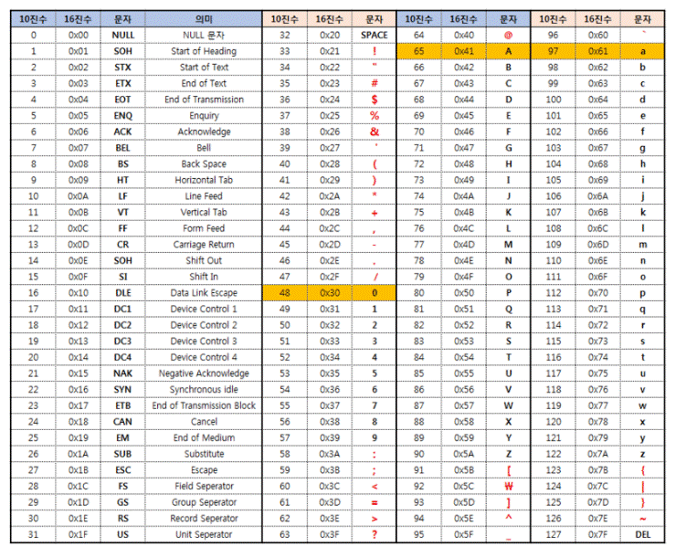

# 문자열의 문자 코드

<br>

## 문자열.charCodeAt()

문자열에서 문자코드를 확인 하기 위해서는 charCodeAt 메서드를 확인하면 된다.

변환되어지는 문자코드는 아래의 아스키코드의 10진수의 고유한 값으로 바뀌어진다.

<br>



<br>

```jsx
"ABCDEF".charCodeAt(2);
// 67
```

<br>

인수의 값은 해당 문자열에서 문자의 인덱스의 값을 얻는다.

<br>

## String.fromCharCode()

<br>

아스키코드의 10진수의 고유의 값을 인수 값으로 넣어주면 그에대한 문자열로 변환된다.

```jsx
String.fromCharCode(65);
// A
```

<br>

## 문자열 문자코드를 이용한 알고리즘 문제

공백을 제외한 알파벳을 n만큼 뒤로 밀어서 계산한 알파벳을 얻는다.

예를들어 A를 1칸 미루면 B가 된다.

<br>

따라서 s의 값이 'AB' 이고 n이 1이면 'BC' 가된다.

<br>

```jsx
function solution(s, n) {
  var answer = "";
  for (let i = 0; i < s.length; i++) {
    // 만약 공백이라면 건너 뛴다.
    if (s[i] === " ") {
      answer += " ";
      continue;
    }

    // 만약 대문자라면
    if (64 < s[i].charCodeAt() && s[i].charCodeAt() < 91) {
      console.log("UpperCase");
      if (90 < s[i].charCodeAt() + n) {
        console.log("overNumber");
        let left = s[i].charCodeAt() + n - 90;

        answer += String.fromCharCode(64 + left);
        continue;
      }
      answer += String.fromCharCode(s[i].charCodeAt() + n);
      continue;
    }

    // 만약 소문자라면
    if (122 < s[i].charCodeAt() + n) {
      console.log("LowerCase");
      let left = s[i].charCodeAt() + n - 122;

      answer += String.fromCharCode(96 + left);
      continue;
    }
    answer += String.fromCharCode(s[i].charCodeAt() + n);
  }

  console.log(answer);

  return answer;
}

solution("a B z", 4);
```
