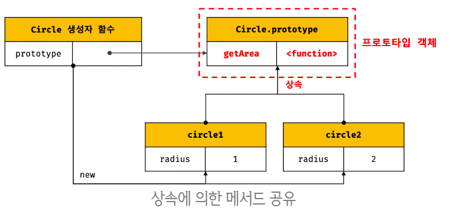
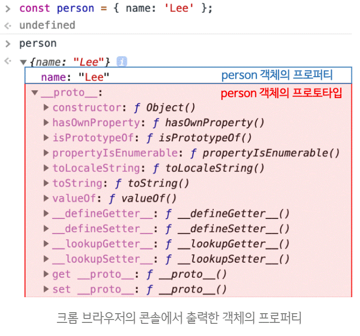

# 프로토타입 - 1

- 출처 [모던 자바스크립트 Deep Dive](http://www.yes24.com/Product/Goods/92742567?OzSrank=1)을 보고 정리한 내용입니다.

[Notion](https://www.notion.so/19-1-504af77d54a146578714ad520e9c8064)

<br>

## 1. 객체지향 프로그래밍

<br>

**객체의 집합으로 프로그램을 표현**하려는 

**프로그래밍 패러다임을 말한다.**

<br>

객체를 실세계의 실체를 인식하는 

철학적 사고를 프로그래밍에 접목 시키려고 했다.

<br>

**실체의 특징이나 성징**을 나타내는 

**속성(attribute/property)[용어]** 을 객체는 가지고 있고

<br>

필요한 속성만 **간추려 내어 표현하는 것을 추상화[용어]** 라고 한다.

```jsx
// 이름과 주소 속성을 갖는 객체
const person = {
  name: 'Lee',
  address: 'Seoul'
};

console.log(person); // {name: "Lee", address: "Seoul"}
```

<br>

속성을 통해 **여러 개의 값**을 

**하나의 단위로 구성한 복합적인 자료구조**를 

**객체**라고 한다.

<br>

객체는

**객체의 상태(state)** 를 나타내는 **데이터**와 

**상태 데이터를 조작 할 수 있는 동작(behavior)** 이있다.

<br>

**상태 데이터 ⇒ 프로퍼티(property**)

**동작 ⇒ 메서드(method)**

<br>

또한 객체는 

**다른 객체와의 관계성을 가질수 있다.**

<br>
<br>

## 2. 상속과 프로토타입

<br>

**상속(inheritance)[용어]** 은 객체지향의 핵심 개념으로,

<br>

**프로퍼티 또는 메서드를 다른 객체에게**

**상속받아 그대로 사용 할 수 있는 것**을 말한다.

(클라우드 서비스처럼)

<br>

자바스크립트는

**프로토타입을 기반**으로

**상속을 구현**한다.

<br>

**What? 상속을 하면 장점이 무엇일까?**

중복적인 코드를 제거

코드 재사용 → 개발 비용 감소

```jsx
// 생성자 함수
function Circle(radius) {
  this.radius = radius;
  this.getArea = function () {
    // Math.PI는 원주율을 나타내는 상수다.
    return Math.PI * this.radius ** 2;
  };
}

// 반지름이 1인 인스턴스 생성
const circle1 = new Circle(1);
// 반지름이 2인 인스턴스 생성
const circle2 = new Circle(2);

// Circle 생성자 함수는 인스턴스를 생성할 때마다 동일한 동작을 하는
// getArea 메서드를 중복 생성하고 모든 인스턴스가 중복 소유한다.
// getArea 메서드는 하나만 생성하여 모든 인스턴스가 공유해서 사용하는 것이 바람직하다.
console.log(circle1.getArea === circle2.getArea); // false

console.log(circle1.getArea()); // 3.141592653589793
console.log(circle2.getArea()); // 12.566370614359172
```

<br>

**getArea 메서드**는

**모든 인스턴스가** 

동일한 내용의 메서드를 사용하므로

**중복 생성하고 중복 소유한다.**

→ 불필요한 중복, 메모리 낭비

**How? 어떻게 중복을 제거할까?**

자바스크립트는

**프로토타입을 기반으로 상속을 구현한다.**

```jsx
// 생성자 함수
function Circle(radius) {
  this.radius = radius;
}

// Circle 생성자 함수가 생성한 모든 인스턴스가 getArea 메서드를
// 공유해서 사용할 수 있도록 프로토타입에 추가한다.
// 프로토타입은 Circle 생성자 함수의 prototype 프로퍼티에 바인딩되어 있다.
Circle.prototype.getArea = function () {
  return Math.PI * this.radius ** 2;
};

// 인스턴스 생성
const circle1 = new Circle(1);
const circle2 = new Circle(2);

// Circle 생성자 함수가 생성한 모든 인스턴스는 부모 객체의 역할을 하는
// 프로토타입 Circle.prototype으로부터 getArea 메서드를 상속받는다.
// 즉, Circle 생성자 함수가 생성하는 모든 인스턴스는 하나의 getArea 메서드를 공유한다.
console.log(circle1.getArea === circle2.getArea); // true

console.log(circle1.getArea()); // 3.141592653589793
console.log(circle2.getArea()); // 12.566370614359172
```



<br>

**모든 인스턴스는**

**상위 객체(Circle.prototype)로부터**

**모든 프로퍼티와 메서드를 상속 받는다.**

→ Circle.prototype.getArea = ...  이렇게 할당한 프로퍼티와 메서드를 받는다는 의미.

<br>

재사용성 GOOD!

인스턴스는 별도의 구현 없어도됨!

<br>

## 3. 프로토타입 객체

<br>

**상위객체가 가지고 있는 프로토타입 객체로**

**하위 객체가 상속을 받아 자유롭게 사용할 수 있다.**

<br>

모든 객체는

[[Prototype]] 내부슬롯을 가지고있다.

이것의 **값은 상위 객체의 프로토타입이다.**

<br>

**객체 생성 방식에 따라**

**프로토타입이 결정되고 [[Prototype]]에 저장된다.**

<br>

Ex)

객체 리터럴 → Object.prototype

인스턴스(객체) → 생성자함수 프로토타입과 연결된 객체

<br>

**모든 객체는 하나의 프로토타입을 갖는다.**

→ [[Prototype]] 내부 슬롯 값이 null인 경우, 프로토타입이 없다.

<br>

생성자 함수는 prototype프로퍼티로→ 프로토타입 객체에 접근

프로토타입 객체는 constructor 프로퍼티로 → 생성자함수 접근

객체(인스턴스)는 __proto__ 로 → 상위객체 프로토타입 객체 접근가능

<br>

### 3.1. __proto__ 접근자 프로퍼티

<br>

**__proto__는 자신의 상위객체 프로토타입이다.**

<br>

**즉!**

[[Prototype]]을 __proto__으로 접근하므로

**[[Prototype]]과 __proto__가 같다라고 생각하면 쉽다.**

<br>

모든 객체는 **__proto__ 접근자 프로퍼티를 통해**

**즉 [[Prototype]] 내부 슬롯에 간접적으로 접근할 수 있다.**

```jsx
const person = { name: 'Lee' };
```



<br>

person객체의 [[Prototype]]인

Object.prototype이다.

<br>

**How? 어떻게 person객체의 [[Prototype]]에 접근할까?**

__proto__ 을통해 

**person [[Prototype]] 이 가리키는**

**상위 객체인 Object.prototype에 접근한 결과**이다.

<br>

**__proto__는 접근자 프로퍼티다.**

접근자 프로퍼티는 자체적으로는 

값([[Value]] 프로퍼티 어트리뷰트)을 갖지 않고

<br>

데이터 프로퍼티의 값을 읽거나 저장할 때 

사용하는 접근자 함수

<br>

**즉 [[Get]], [[Set]] 프로퍼티 어트리뷰트로 구성된 프로퍼티다.**

<br>

**프로토타입에 접근하면** 

**getter 함수인 [Get]이 호출**된다.

<br>

**프로토타입을 할당하면**

**setter 함수인 [Set]이 호출**된다.

```jsx
const obj = {};
const parent = { x: 1 };

// getter 함수인 get __proto__가 호출되어 obj 객체의 프로토타입을 취득
obj.__proto__;
// setter함수인 set __proto__가 호출되어 obj 객체의 프로토타입을 교체
obj.__proto__ = parent;

console.log(obj.x); // 1
```

<br>

**proto 접근자 프로퍼티는 상속을 통해 사용된다.**

<br>

**사실 __proto__ 는**

**객체가 직접 소유하는 프로퍼티가 아니다.**

<br>

모든 객체는 **상속을 통해** 

**Object.prototype.__proto__접근자 프로퍼티를 사용할 수 있다.**

```jsx
const person = { name: 'Lee' };

// person 객체는 __proto__ 프로퍼티를 소유하지 않는다.
console.log(person.hasOwnProperty('__proto__')); // false

// __proto__ 프로퍼티는 모든 객체의 프로토타입 객체인 Object.prototype의 접근자 프로퍼티다.
console.log(Object.getOwnPropertyDescriptor(Object.prototype, '__proto__'));
// {get: ƒ, set: ƒ, enumerable: false, configurable: true}

// 모든 객체는 Object.prototype의 접근자 프로퍼티 __proto__를 상속받아 사용할 수 있다.
console.log({}.__proto__ === Object.prototype); // true
```

<br>

**Object.prototype**

모든 객체는

**프로토타입의 계층 구조인**

**프로토타입 체인**에 묶여있다.

<br>

**객체 프로퍼티 접근과정**

1 . 해당 객체의 접근하려는 **프로퍼티 검색**

2 . 없으면 **__proto__ 를 검색 → 부모 객체의 프로토타입 검색**

**(어차피 부모 프로퍼티도 __proto__에 포함되어 있다.)**

3 . **순차적으로 검색**후 종점인, **최상위 객체는 Object.prototype 이다.**

<br>

따라서 모든 객체는 

**Object.prototype 프로퍼티와 메서드를 상속받는다.**

<br>

**proto 접근자 프로퍼티를 통해 프로토타입에 접근하는 이유**

**상호 참조**에 의해 프로토타입 체인이 

생성되는 것을 **방지하기 위해서다.**

```jsx
const parent = {};
const child = {};

// child의 프로토타입을 parent로 설정
child.__proto__ = parent;
// parent의 프로토타입을 child로 설정
parent.__proto__ = child; // TypeError: Cyclic __proto__ value
```

**프로토타입 체인은**

**단방향 링크드 리스트** 여야한다.

<br>

**프로토타입 체인 종점이 존재하지않아**

**프로퍼티를 검색할때**

**무한루프에 빠진다.**

<br>

**proto 접근자 프로퍼티를 코드 내에서 직접 사용하는 것은 권장하지 않는다.**

<br>

**Why? 권장하지 않을까?**

모든객체가 __proto__를 사용할 수 있지않다.

<br>

**직접 상속**을 통해 

**Object.prototype을 상속받지 않는 객체를** 

**생성할 수도 있기 때문이다.**

<br>

Object.creat()로 자신이 상속받을 상위객체를 선택 할 수 있다.

```jsx
// obj는 프로토타입 체인의 종점이다. 따라서 Object.__proto__를 상속받을 수 없다.
const obj = Object.create(null);

// obj는 Object.__proto__를 상속받을 수 없다.
console.log(obj.__proto__); // undefined

// 따라서 Object.getPrototypeOf 메서드를 사용하는 편이 좋다.
console.log(Object.getPrototypeOf(obj)); // null
```

<br>

**대신!**

**프로토타입의 참조를 가지고 싶을때**

(자신의 상위객체의 프로토타입를 참조하고 싶을때)

**Object.getPrototypeOf 메서드를 사용하고**

<br>

**프로토타입을 교체 하고 싶은 경우**

**Object.setPrototypeOf 메서드를 사용**

(상속을 다른 상위객체로 교체한다.)

```jsx
const obj = {};
const parent = { x: 1 };

// obj 객체의 프로토타입을 취득
Object.getPrototypeOf(obj); // obj.__proto__;
// obj 객체의 프로토타입을 교체
Object.setPrototypeOf(obj, parent); // obj.__proto__ = parent;

console.log(obj.x); // 1
```

<br>

### 3.2. 함수 객체의 prototype 프로퍼티

<br>

**함수 객체만이 생성자 함수를 만들 수 있으므로**

**prototype 은 함수 객체만이 가진다.**

<br>

```jsx
// 함수 객체는 prototype 프로퍼티를 소유한다.
(function () {}).hasOwnProperty('prototype'); // -> true

// 일반 객체는 prototype 프로퍼티를 소유하지 않는다.
({}).hasOwnProperty('prototype'); // -> false
```

<br>

그리고 함수 객체에서도

**constructor인 함수들만 가질 수 있다.**

<br>

**non-constructor은 생성자 함수가 되지 않으므로**

**prototype을 가질 필요가 없다. (상속되어지지 않으므로)**

<br>

→ prototype을 가진다는 의미는

상속이 되어지겠다는 의미이므로.

```jsx
// 화살표 함수는 non-constructor다.
const Person = name => {
  this.name = name;
};

// non-constructor는 prototype 프로퍼티를 소유하지 않는다.
console.log(Person.hasOwnProperty('prototype')); // false

// non-constructor는 프로토타입을 생성하지 않는다.
console.log(Person.prototype); // undefined

// ES6의 메서드 축약 표현으로 정의한 메서드는 non-constructor다.
const obj = {
  foo() {}
};

// non-constructor는 prototype 프로퍼티를 소유하지 않는다.
console.log(obj.foo.hasOwnProperty('prototype')); // false

// non-constructor는 프로토타입을 생성하지 않는다.
console.log(obj.foo.prototype); // undefined
```

<br>

생성자 함수로 호출되어지지 않은

**일반 함수들은** 

**prototype 프로퍼티를 소유하지만**

**아무런 의미가 없다.**

(아무도 protype을 상속받지 않으므로)

<br>

```jsx
// 생성자 함수
function Person(name) {
  this.name = name;
}

const me = new Person('Lee');

// 결국 Person.prototype과 me.__proto__는 결국 동일한 프로토타입을 가리킨다.
console.log(Person.prototype === me.__proto__);  // true
```

### 3.3. 프로토타입의 constructor 프로퍼티와 생성자 함수

**생성자 함수**는

**프로토타입을 가지며**

**Constructor 프로퍼티를 갖는다.**

<br>

**What? Constructor 은 어떤 값을 가질까?**

**부모객체인 생성자 함수를 가리킨다.**

<br>

**(사실 자기 자신 함수을 가리키는 것이다.** 

**obj.__proto__.constructor 인데**

**중간의 __proto__를 생략한것이라** 

**생성자 함수를 가리키는 것처럼 보이는것.)**

```jsx
// 생성자 함수
function Person(name) {
  this.name = name;
}

const me = new Person('Lee');

// me 객체의 생성자 함수는 Person이다.
console.log(me.constructor === Person);  // true
```

<br>

## 4. 리터럴 표기법에 의해 생성된 객체의 생성자 함수와 프로토타입

**constructor 프로퍼티가 가리키는 것은**

**생성자 함수이다.**

```jsx
// obj 객체를 생성한 생성자 함수는 Object다.
const obj = new Object();
console.log(obj.constructor === Object); // true

// add 함수 객체를 생성한 생성자 함수는 Function이다.
const add = new Function('a', 'b', 'return a + b');
console.log(add.constructor === Function); // true

// 생성자 함수
function Person(name) {
  this.name = name;
}

// me 객체를 생성한 생성자 함수는 Person이다.
const me = new Person('Lee');
console.log(me.constructor === Person); // true
```

<br>

생성자 함수가 아닌

리터럴 표기법으로 생성한 객체들도 있다.

```jsx
// 객체 리터럴
const obj = {};

// 함수 리터럴
const add = function (a, b) { return a + b; };

// 배열 리터럴
const arr = [1, 2, 3];

// 정규표현식 리터럴
const regexp = /is/ig;
```

<br>

**리터럴 표기법에 의해 생성된 객체도** 

**가상적인 생성자 함수를 갖는다.**

<br>

**프로토타입과 생성자 함수는 단독으로 존재할 수 없고** 

**언제나 쌍(pair)으로 존재한다.**

<br>

**Why? 쌍으로 존재할까?**

prototype 과 constructor은 프로퍼티에 의해 **연결되어 있기때문이다.**

<br>
