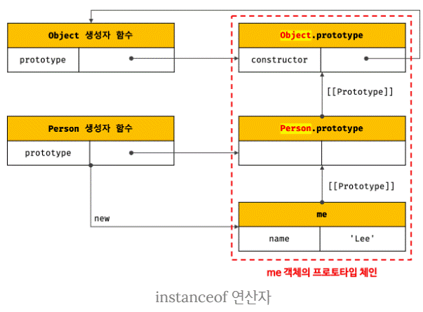
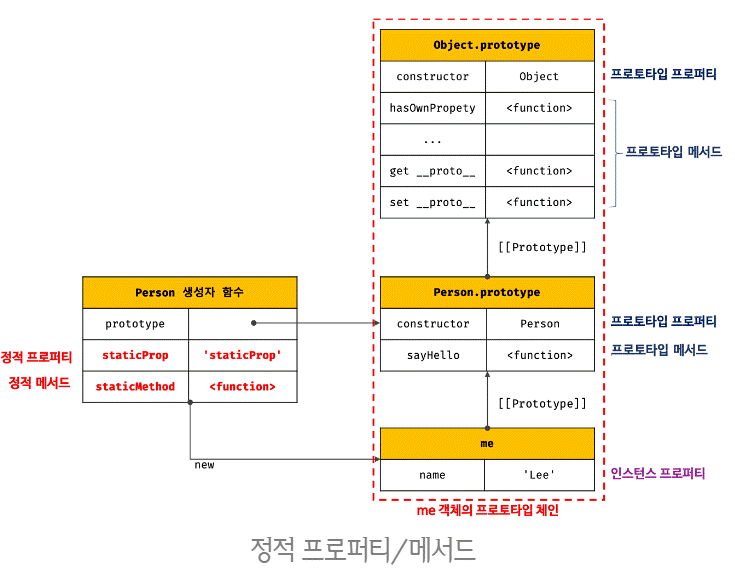
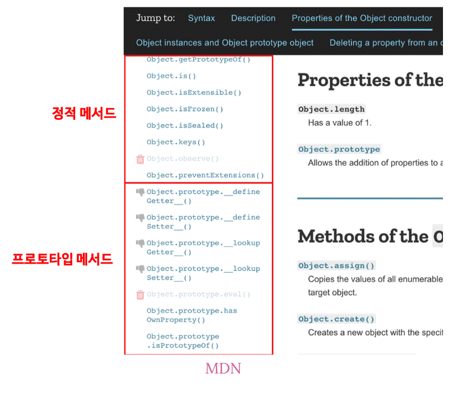

# 프로토타입-3

[Notion](https://www.notion.so/19-3-04100257620b418b8de4d6e638676d7a)

## 10. instanceof 연산자

<br>

**instanceof 연산자는**

<br>

**좌변**에 **객체를 가리키는 식별자**

**우변**에 **생성자 함수를 가리키는 식별자**

<br>

**주의!**

만약 우변의 피연산자가

**함수가 아닌경우 TypeError 발생**

<br>

```jsx
객체 instanceof 생성자 함수
```

**우변의 생성자 함수가**

**좌변의 객체 프로토타입 체인에 있으면**

**ture 아니면 false로 평가된다.**

<br>

```jsx
// 생성자 함수
function Person(name) {
  this.name = name;
}

const me = new Person('Lee');

// Person.prototype이 me 객체의 프로토타입 체인 상에 존재하므로 true로 평가된다.
console.log(me instanceof Person); // true

// Object.prototype이 me 객체의 프로토타입 체인 상에 존재하므로 true로 평가된다.
console.log(me instanceof Object); // true
```

<br>

만약 인스턴스에 의해

**프로토타입이 교체된경우는 어떻게 될까?**

```jsx
// 생성자 함수
function Person(name) {
  this.name = name;
}

const me = new Person('Lee');

// 프로토타입으로 교체할 객체
const parent = {};

// 프로토타입의 교체
Object.setPrototypeOf(me, parent);

// Person 생성자 함수와 parent 객체는 연결되어 있지 않다.
console.log(Person.prototype === parent); // false
console.log(parent.constructor === Person); // false

// Person.prototype이 me 객체의 프로토타입 체인 상에 존재하지 않기 때문에 false로 평가된다.
console.log(me instanceof Person); // false

// Object.prototype이 me 객체의 프로토타입 체인 상에 존재하므로 true로 평가된다.
console.log(me instanceof Object); // true
```

<br>

**예제풀이)**

**me 프로토타입 체인상에**

**Person.prototype이 존재 하지 않아 false로 평가되었다.**

<br>

**parent 객체와 Person 생성자 함수를**

**연결하면 true로 평가된다.**

```jsx
// 생성자 함수
function Person(name) {
  this.name = name;
}

const me = new Person('Lee');

// 프로토타입으로 교체할 객체
const parent = {};

// 프로토타입의 교체
Object.setPrototypeOf(me, parent);

// Person 생성자 함수와 parent 객체는 연결되어 있지 않다.
console.log(Person.prototype === parent); // false
console.log(parent.constructor === Person); // false

// parent 객체를 Person 생성자 함수의 prototype 프로퍼티에 바인딩한다.
Person.prototype = parent;

// Person.prototype이 me 객체의 프로토타입 체인 상에 존재하므로 true로 평가된다.
console.log(me instanceof Person); // true

// Object.prototype이 me 객체의 프로토타입 체인 상에 존재하므로 true로 평가된다.
console.log(me instanceof Object); // true
```

<br>

**즉!**

instanceof 연산자는

<br>

**constructor 프로퍼티**가 가리키는 

**생성자 함수를 찾는 것이 아니다.**

<br>

**프로토타입 체인 상에**

**생성자 함수 프로토타입이 존재하는지 확인한다.**



**How? instanceof 연산자는 어떻게 동작할까?**

```jsx
function isInstanceof(instance, constructor) {
  // 프로토타입 취득
  const prototype = Object.getPrototypeOf(instance);

  // 재귀 탈출 조건
  // prototype이 null이면 프로토타입 체인의 종점에 다다른 것이다.
  if (prototype === null) return false;

  // 프로토타입이 생성자 함수의 prototype 프로퍼티에 바인딩된 객체라면 true를 반환한다.
  // 그렇지 않다면 재귀 호출로 프로토타입 체인 상의 상위 프로토타입으로 이동하여 확인한다.
  return prototype === constructor.prototype || isInstanceof(prototype, constructor);
}

console.log(isInstanceof(me, Person)); // true
console.log(isInstanceof(me, Object)); // true
console.log(isInstanceof(me, Array));  // false
```

<br>

constructor 프로퍼티가

instanceof 연산자에 아무런 영향이 없는것을 알 수 있다.

```jsx
const Person = (function () {
  function Person(name) {
    this.name = name;
  }

  // 생성자 함수의 prototype 프로퍼티를 통해 프로토타입을 교체
  Person.prototype = {
    sayHello() {
      console.log(`Hi! My name is ${this.name}`);
    }
  };

  return Person;
}());

const me = new Person('Lee');

// constructor 프로퍼티와 생성자 함수 간의 연결은 파괴되어도 instanceof는 아무런 영향을 받지 않는다.
console.log(me.constructor === Person); // false

// Person.prototype이 me 객체의 프로토타입 체인 상에 존재하므로 true로 평가된다.
console.log(me instanceof Person); // true
// Object.prototype이 me 객체의 프로토타입 체인 상에 존재하므로 true로 평가된다.
console.log(me instanceof Object); // true
```

<br>
<br>

## 11. 직접 상속

<br>

### 11.1 object.create에 의한 직접 상속

<br>

**object.create 메서드는**

**명시적으로 프로토타입을 지정**하여

**새로운 객체를 생성**한다.

<br>

이것또한

OrdinaryObjectCreate를 호출한다.

<br>

**첫번째 매개변수**는

**생성할 객체의 프로토타입**으로 

지정할 객체를 전달한다.

<br>

**두번째 매개변수**는

생성할 객체의

**프로퍼티 키와 프로퍼티 디스크립터 객체를 전달한다**.(value, writable, enumerable, configurable)

→ 두번째 인수는 생략가능

<br>

```jsx
/**
 * 지정된 프로토타입 및 프로퍼티를 갖는 새로운 객체를 생성하여 반환한다.
 * @param {Object} prototype - 생성할 객체의 프로토타입으로 지정할 객체
 * @param {Object} [propertiesObject] - 생성할 객체의 프로퍼티를 갖는 객체
 * @returns {Object} 지정된 프로토타입 및 프로퍼티를 갖는 새로운 객체
 */
Object.create(prototype[, propertiesObject])
```

```jsx
// 프로토타입이 null인 객체를 생성한다. 생성된 객체는 프로토타입 체인의 종점에 위치한다.
// obj → null
let obj = Object.create(null);
console.log(Object.getPrototypeOf(obj) === null); // true
// Object.prototype을 상속받지 못한다.
console.log(obj.toString()); // TypeError: obj.toString is not a function

// obj → Object.prototype → null
// obj = {};와 동일하다.
obj = Object.create(Object.prototype);
console.log(Object.getPrototypeOf(obj) === Object.prototype); // true

// obj → Object.prototype → null
// obj = { x: 1 };와 동일하다.
obj = Object.create(Object.prototype, {
  x: { value: 1, writable: true, enumerable: true, configurable: true }
});
// 위 코드는 다음과 동일하다.
// obj = Object.create(Object.prototype);
// obj.x = 1;
console.log(obj.x); // 1
console.log(Object.getPrototypeOf(obj) === Object.prototype); // true

const myProto = { x: 10 };
// 임의의 객체를 직접 상속받는다.
// obj → myProto → Object.prototype → null
obj = Object.create(myProto);
console.log(obj.x); // 10
console.log(Object.getPrototypeOf(obj) === myProto); // true

// 생성자 함수
function Person(name) {
  this.name = name;
}

// obj → Person.prototype → Object.prototype → null
// obj = new Person('Lee')와 동일하다.
obj = Object.create(Person.prototype);
obj.name = 'Lee';
console.log(obj.name); // Lee
console.log(Object.getPrototypeOf(obj) === Person.prototype); // true
```

<br>

**Object.create 메서드는**

**객체를 생성하면서**

**직접적으로 상속을 구현한다.**

<br>

**What? Object.create 메서드의 장점?**

<br>

- **new 연산자가 없이도 객체를 생성**할 수 있다.
- **프로토타입을 지정하면서 객체를 생성**할 수 있다.
- **객체 리터럴에 의해 생성된 객체도 상속**받을 수 있다.

<br>

Object.prototype 빌트인 메서드는

프로토타입 체인의 종점에 위치해

모든 객체가 상속받아 사용 가능하다.

<br>

```jsx
const obj = { a: 1 };

obj.hasOwnProperty('a');       // -> true
obj.propertyIsEnumerable('a'); // -> true
```

<br>

**하지만!**

Object.create 메서드를 통해

<br>

**프로토타입 체인의 종점에 위치하는**

**객체를 생성하면**

<br>

**Object.prototype 빌트인 메서드를 사용할 수 없다.**

```jsx
/ 프로토타입이 null인 객체, 즉 프로토타입 체인의 종점에 위치하는 객체를 생성한다.
const obj = Object.create(null);
obj.a = 1;

console.log(Object.getPrototypeOf(obj) === null); // true

// obj는 Object.prototype의 빌트인 메서드를 사용할 수 없다.
console.log(obj.hasOwnProperty('a')); // TypeError: obj.hasOwnProperty is not a function
```

<br>

따라서

간접 호출 하는것이 좋다.

<br>

**How? 어떻게 간접 호출할까?**

Function.prototype.call 메서드

```jsx
// 프로토타입이 null인 객체를 생성한다.
const obj = Object.create(null);
obj.a = 1;

// console.log(obj.hasOwnProperty('a')); // TypeError: obj.hasOwnProperty is not a function

// Object.prototype의 빌트인 메서드는 객체로 직접 호출하지 않는다.
console.log(Object.prototype.hasOwnProperty.call(obj, 'a')); // true
```

<br>

### 11.2. 객체 리터럴 내부에서 __proto__ 에 의한 직접 상속

<br>

Object.create 메서드로 직접상속시,

두 번째 인자로 프로퍼티 정의시 번거롭다.

<br>

**ES6에서 객체 리터럴 내부에서**

**__proto__ 접근자 프로퍼티를 사용해**

**직접 상속을 구현할 수 있게되었다.**

```jsx
const myProto = { x: 10 };

// 객체 리터럴에 의해 객체를 생성하면서 프로토타입을 지정하여 직접 상속받을 수 있다.
const obj = {
  y: 20,
  // 객체를 직접 상속받는다.
  // obj → myProto → Object.prototype → null
  __proto__: myProto
};
/* 위 코드는 아래와 동일하다.
const obj = Object.create(myProto, {
  y: { value: 20, writable: true, enumerable: true, configurable: true }
});
*/

console.log(obj.x, obj.y); // 10 20
console.log(Object.getPrototypeOf(obj) === myProto); // true
```

<br>
<br>

## 12. 정적 프로퍼티/메서드

```jsx
// 생성자 함수
function Person(name) {
  this.name = name;
}

// 프로토타입 메서드
Person.prototype.sayHello = function () {
  console.log(`Hi! My name is ${this.name}`);
};

// 정적 프로퍼티
Person.staticProp = 'static prop';

// 정적 메서드
Person.staticMethod = function () {
  console.log('staticMethod');
};

const me = new Person('Lee');

// 생성자 함수에 추가한 정적 프로퍼티/메서드는 생성자 함수로 참조/호출한다.
Person.staticMethod(); // staticMethod

// 정적 프로퍼티/메서드는 생성자 함수가 생성한 인스턴스로 참조/호출할 수 없다.
// 인스턴스로 참조/호출할 수 있는 프로퍼티/메서드는 프로토타입 체인 상에 존재해야 한다.
me.staticMethod(); // TypeError: me.staticMethod is not a function
```

<br>

**Person 생성자 함수 객체가** 

**소유한 프로퍼티/메서드를** 

**정적 프로퍼티/메서드[용어]라고 한다.**

(프로토타입에 있지 않은 프로퍼티, this로 연결되지 않은 프로퍼티)



<br>

**정적 프로퍼티/메서드는** 

인스턴스의 **프로토타입 체인에 속하지 않으므로**

**인스턴스로 접근할 수 없다.**

<br>

```jsx
// Object.create는 정적 메서드다.
const obj = Object.create({ name: 'Lee' });

// Object.prototype.hasOwnProperty는 프로토타입 메서드다.
obj.hasOwnProperty('name'); // -> false
```

<br>

프로토타입 프로퍼티는

인스턴스를 생성후 사용해야하지만

<br>

정적 프로퍼티 / 메서드는

바로 사용해도 된다.

```jsx
function Foo() {}

// 프로토타입 메서드
// this를 참조하지 않는 프로토타입 메소드는 정적 메서드로 변경해도 동일한 효과를 얻을 수 있다.
Foo.prototype.x = function () {
  console.log('x');
};

const foo = new Foo();
// 프로토타입 메서드를 호출하려면 인스턴스를 생성해야 한다.
foo.x(); // x

// 정적 메서드
Foo.x = function () {
  console.log('x');
};

// 정적 메서드는 인스턴스를 생성하지 않아도 호출할 수 있다.
Foo.x(); // x
```

<br>

**정적 메서드 VS 프로토타입 메서드 구별법**



<br>

Object.prototype.isPrototypeOf를 

Object#isPrototypeOf으로 표기하는 경우도 있다.

<br>
<br>

## 13. 프로퍼티 존재 확인

<br>

### 13.1. in 연산자

<br>

**in 연산자는** 

**특정 프로퍼티가 존재하는지 여부를 확인한다.**

```jsx
/**
 * key: 프로퍼티 키를 나타내는 문자열
 * object: 객체로 평가되는 표현식
 */
key in object
```

```jsx
const person = {
  name: 'Lee',
  address: 'Seoul'
};

// person 객체에 name 프로퍼티가 존재한다.
console.log('name' in person);    // true
// person 객체에 address 프로퍼티가 존재한다.
console.log('address' in person); // true
// person 객체에 age 프로퍼티가 존재하지 않는다.
console.log('age' in person);     // fal
```

<br>

in 연산자는

자신의 객체 프로퍼티 뿐만아니라

<br>

**상속 받는 모든 프로토타입 프로퍼티를**

**확인하므로 주의해야한다.**

```jsx
console.log('toString' in person); // true
```

<br>

**Reflect.has** 메서드를 대신 사용가능하다.

```jsx
const person = { name: 'Lee' };

console.log(Reflect.has(person, 'name'));     // true
console.log(Reflect.has(person, 'toString')); // true
```

<br>

### 13.2 Object.prototype.hasOwnProperty 메서드

<br>

```jsx
console.log(person.hasOwnProperty('name')); // true
console.log(person.hasOwnProperty('age'));  // false
```

<br>

**Object.prototype.hasOwnProperty 메서드는**

<br>

**객체 고유의 프로퍼티인 경우에만 true를 반환한다.**

**상속받은 프로퍼티는 false를 반환한다.**

```jsx
console.log(person.hasOwnProperty('toString')); // false
```

<br>
<br>

## 14. 프로퍼티 열거

<br>

### 14.1. for...in문

<br>

**객체의 모든 프로퍼티를** 

**순회하며 열거할때 사용한다.**

<br>

**프로퍼티 개수만큼 순회한다.**

```jsx
for (변수선언문 in 객체) { ... }
```

```jsx
const person = {
  name: 'Lee',
  address: 'Seoul'
};

// for...in 문의 변수 prop에 person 객체의 프로퍼티 키가 할당된다.
for (const key in person) {
  console.log(key + ': ' + person[key]);
}
// name: Lee
// address: Seoul
```

<br>

**for...in문 또한 in 연산자 처럼**

대상 객체의 프로퍼티 뿐아니라

<br>

**상속받은 프로토타입의 프로퍼티 까지 열거한다.**

<br>

**But!**

toString과 같은 

**Object.prototype의 프로퍼티는 열거되지 않는다.**

```jsx
const person = {
  name: 'Lee',
  address: 'Seoul'
};

// in 연산자는 객체가 상속받은 모든 프로토타입의 프로퍼티를 확인한다.
console.log('toString' in person); // true

// for...in 문도 객체가 상속받은 모든 프로토타입의 프로퍼티를 열거한다.
// 하지만 toString과 같은 Object.prototype의 프로퍼티가 열거되지 않는다.
for (const key in person) {
  console.log(key + ': ' + person[key]);
}

// name: Lee
// address: Seoul
```

<br>

**Why? 열거되지 않을까?**

**Object.prototype.string 프로퍼티의** 

**프로퍼티 어트리뷰트 [[Enumerable]]의 값이 false이기 때문이다.**

```jsx
// Object.getOwnPropertyDescriptor 메서드는 프로퍼티 디스크립터 객체를 반환한다.
// 프로퍼티 디스크립터 객체는 프로퍼티 어트리뷰트 정보를 담고 있는 객체다.
console.log(Object.getOwnPropertyDescriptor(Object.prototype, 'toString'));
// {value: ƒ, writable: true, enumerable: false, configurable: true}
```

<br>

**즉!**

**for…in 문은** 

**객체의 프로토타입 체인 상에** 

**존재하는 모든 프로토타입의 프로퍼티 중에서** 

<br>

**프로퍼티 어트리뷰트 [[Enumerable]]의 값이** 

**ture인 프로퍼티를 순회하며 열거(enumeration)한다.**

```jsx
const person = {
  name: 'Lee',
  address: 'Seoul',
  __proto__: { age: 20 }
};

for (const key in person) {
  console.log(key + ': ' + person[key]);
}
// name: Lee
// address: Seoul
// age: 20
```

<br>

심벌인 프로퍼티는 열거하지 않는다.

```jsx
const sym = Symbol();
const obj = {
  a: 1,
  [sym]: 10
};

for (const key in obj) {
  console.log(key + ': ' + obj[key]);
}
// a: 1
```

<br>

상속받은 프로퍼티를 제외하고

**자신의 프로퍼티만 열거하려면**

```jsx
const person = {
  name: 'Lee',
  address: 'Seoul',
  __proto__: { age: 20 }
};

for (const key in person) {
  // 객체 자신의 프로퍼티인지 확인한다.
  if (!person.hasOwnProperty(key)) continue;
  console.log(key + ': ' + person[key]);
}
// name: Lee
// address: Seoul
```

<br>

**주의!**

for…in 문은 

프로퍼티를 열거할 때 

순서를 보장하지 않는다.

<br>

**하지만** 

**대부분 모던 브라우저는 순서를 보장하고**

**숫자인 프로퍼티키에 대해서는 정렬을 한다.**

```jsx
const obj = {
  2: 2,
  3: 3,
  1: 1,
  b: 'b',
  a: 'a'
};

for (const key in obj) {
  if (!obj.hasOwnProperty(key)) continue;
  console.log(key + ': ' + obj[key]);
}

/*
1: 1
2: 2
3: 3
b: b
a: a
*/
```

<br>

**주의!**

배열은 for..in 문 권장 하지않는다.

<br>

**대신에!**

- **일반적인 for문**
- **for...of문**
- **Array.prototype.forEach 메서드**

**사용을 권장한다.**

```jsx
const arr = [1, 2, 3];
arr.x = 10; // 배열도 객체이므로 프로퍼티를 가질 수 있다.

for (const i in arr) {
  // 프로퍼티 x도 출력된다.
  console.log(arr[i]); // 1 2 3 10
};

// arr.length는 3이다.
for (let i = 0; i < arr.length; i++) {
  console.log(arr[i]); // 1 2 3
}

// forEach 메서드는 요소가 아닌 프로퍼티는 제외한다.
arr.forEach(v => console.log(v)); // 1 2 3

// for...of는 변수 선언문에서 선언한 변수에 키가 아닌 값을 할당한다.
for (const value of arr) {
  console.log(value); // 1 2 3
};
```

<br>

### 14.2. Object.keys/values/entries 메서드

<br>

Object.prototype.hasOwnProperty 메서드를 사용하여 

객체 자신의 프로퍼티인지 

확인하는 추가 처리가 필요하다.

(번거롭다)

<br>

**자신의 고유 프로퍼티만을** 

**열거하기 위해서**

<br>

**Object.keys/values/entries 메서드를** 

**사용하는 것을 권장한다.**

<br>

**Object.keys 메서드는**

객체 자신의 열거 가능한(enumerable) 

**프로퍼티 키를 배열로 반환한다.**

<br>

```jsx
const person = {
  name: 'Lee',
  address: 'Seoul',
  __proto__: { age: 20 }
};

console.log(Object.keys(person)); // ["name", "address"]
```

<br>

ES8에서 도입된 

**Object.values 메서드는** 

객체 자신의 열거 가능한 

**프로퍼티 값을 배열로 반환한다.**

```jsx
console.log(Object.values(person)); // ["Lee", "Seoul"]
```

<br>

ES8에서 도입된 

**Object.entries 메서드는** 

객체 자신의 열거 가능한 

**프로퍼티 키와 값의 쌍의 배열을 배열에 담아 반환한다.**

```jsx
console.log(Object.entries(person)); // [["name", "Lee"], ["address", "Seoul"]]

Object.entries(person).forEach(([key, value]) => console.log(key, value));
/*
name Lee
address Seoul
*/
```