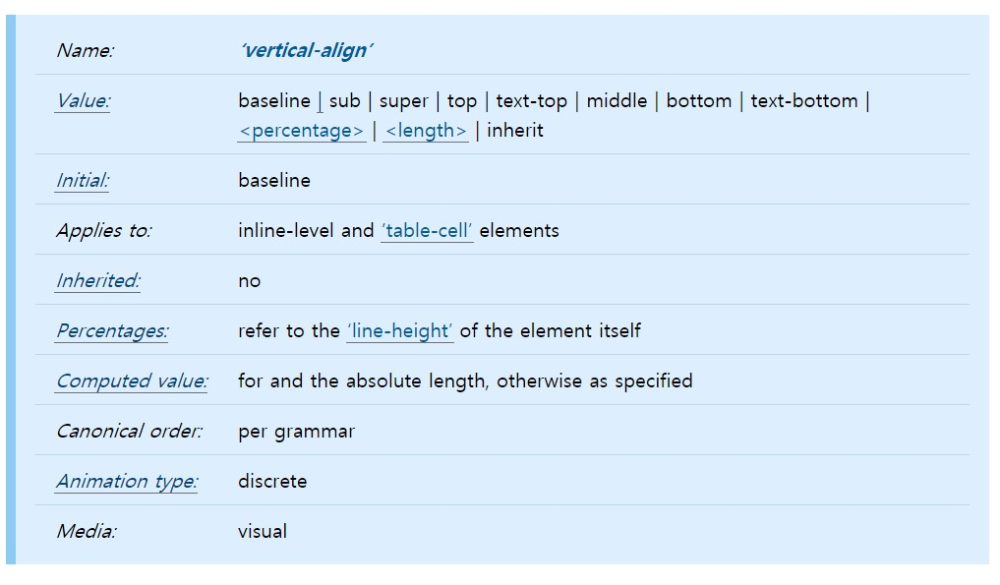

Vertical-align
===

이름 : vertical-align 
값 : 	baseline | sub | super | top | text-top | middle | bottom | text-bottom | percentage | length | inherit 
초기값: baseline 
적용하는 곳 : inline-level 과 table-cell 요소들 
상속 : X
percentage : 그요소의 line-hegiht 에따라 percentage를 적용한다.

---

## Line-height

Line-height값은 텍스트 위쪽에 행간(leading)과 폰트의 크기를 통제하는 것으로 line-height에서 font-size를 뺀 값이 각각 위아래로 들어간다.

---

>상자의 base-line을 부모 상자의 base-line에 맞춘다. 상자에 base-line이 없으면 아래쪽 margin 모서리를 부모의 base-line라고 생각하고 정렬한다.
---

>기존의 baseline과 글자 x의 height 가운데에서의 중간지점에 정렬한다.

---

>요소의 인라인박스의 상단을, 라인박스의 상단에 정렬​​​
---

>요소의 인라인박스의 하단을, 라인박스의 하단에 정렬
----
aligend with : ~을 기준으로(맞춰) 정렬하다.

[HIVELAB](http://blog.hivelab.co.kr/%EA%B3%B5%EC%9C%A0-vertical-align-%ED%8C%8C%ED%97%A4%EC%B9%98%EA%B8%B0-1%EB%B6%80/)을 참조하고 더 자세한 내용은 이곳에서 공부하면된다.

