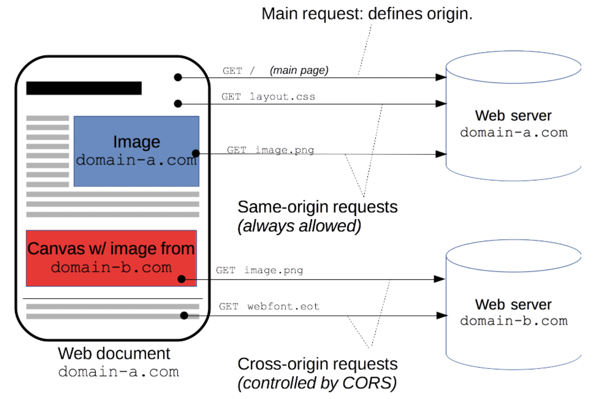

# CORS(Cross-Origin Resource Sharing)

<br>

CORS란 Cross-Origin Resource Sharing의 약자, 교차 출처 리소스 공유이다.

<br>

웹 어플리케이션이 자기가 로드되었던 그 origin과 동일한 origin으로 리소스를 요청하는 것만 허용한다는 뜻이다.

<br>

즉, 기존의 HTML, CSS, 이미지, 폰트 등 파일들의 리소스를 각각의 출처를 받는다.

그때 자바스크립트를 통해 기존에 자신이 사용한 origin이 아니라 다른 도메인, 프로토콜, 포트에 있는 리소스를 요청하면 웹 어플리케이션은 cross-origin HTTP 요청을 실행한다.

<br>

---

<br>

예시를 통해서 보면 이렇다.



이미지 출처: [https://developer.mozilla.org/ko/docs/Web/HTTP/CORS](https://developer.mozilla.org/ko/docs/Web/HTTP/CORS)

<br>

## CORS 적용된 브라우저와 서버 통신 과정

예시로 브라우저와 서버가 통신하는 과정에서

https://domain-a.com의 프론트 엔드 JavaScript 코드가 XMLHttpRequest를 사용하여 **https://domain-b.com/data.json(다른 서버)을 요청한다.**

<br>

보안상 이유로 브라우저는 자신과 동일한 도메인으로만 HTTP 요청을 보내도록 제한하여, XMLHttpRequest와 Fetch API는 **same-origin policy(동일 출처 정책)**을 따른다.

<br>

이렇게 same-origin-policy를 적용받아 제한 받아져서 CORS를 도입했다.

<br>

CORS를 통해 다른 도메인으로 요청을 했을때 cross-domain을 요청할수 있게 되었다.

<br>

XMLHttpRequest와 Fetch API를 사용하는 웹 애플리케이션은 **자신의 출처와 동일한 리소스만 불러올 수 있으며**, **다른 출처의 리소스를 불러오면 그 출처에서 올바른 CORS 헤더를 포함한 응답을 반환해야한다.**

<br>

## CORS를 통한 보안강화

CORS 체제는 브라우저와 서버 간의 안전한 교차 출처 요청(Cross-origin-requests) 및 데이터 전송이 가능하다.

<br>

최신 브라우저는 XMLHttpRequest 또는 Fetch와 같은 API에서 CORS를 사용하여 교차 출처 요청(Cross-origin-requests) 요청의 위험을 보안한다.

<br>

---

<br>

## Preflight request


이미지 출처: [https://www.popit.kr/cors-preflight-인증-처리-관련-삽질/](https://www.popit.kr/cors-preflight-%EC%9D%B8%EC%A6%9D-%EC%B2%98%EB%A6%AC-%EA%B4%80%EB%A0%A8-%EC%82%BD%EC%A7%88/)

<br>

**브라우저는 먼저 서버에 Preflight request(예비 요청)을 전송하여 OPTIONS 메서드를 통해 다른 도메인의 리소스 요청을 보내서** **실제 요청을 보내는 것이 안전한지 확인한다.**

<br>

그 이후 서버로부터 유효하다는 응답을 받으면 HTTP request 메소드와 함께 Actual request(본 요청)을 보낸다. 만약 유효하지 않다면 에러를 발생시키고 실제 요청은 서버로 전송하지 않는다.

<br>

## Simple Request

일부 요청들은 CORS Preflight request를 하지않는다.

이러한 요청들을 Simple Request 라고한다.

Simple Request의 경우는 아래의 3가지 조건이 모두 만족되는 경우를 말한다.

<br>

- GET / [HEAD](https://developer.mozilla.org/ko/docs/Web/HTTP/Methods/HEAD)(특정 리소스를 GET 메서드로 요청했을 때 돌아올 헤더를 요청한다.) / POST 중 한 가지 메소드를 사용한다.
- 요청 헤더에 user agent에 의해 자동적으로 정해지는 헤더(Connection, User-Agent, [Fetch 스펙에 정의된 "forbidden header name"](https://fetch.spec.whatwg.org/#forbidden-header-name))를 제외, 그리고 [Fetch 스펙에 정의된 "CORS-safelisted request-header"](https://fetch.spec.whatwg.org/#cors-safelisted-request-header) 포함하는 경우
- Content-Type 헤더의 값이 다음의 값 중 하나일 때
  - application/x-www-form-urlencoded
  - multipart/form-data
  - text/plain

<br>

### 코드로 보는 Simple request 브라우저 서버 통신 과정

<br>

1. 예를들어, **https://foo.example** 의 웹 컨텐츠가 **https://bar.other** 도메인의 컨텐츠를 호출하길 원한다.
2. 브라우저가 서버로 전송하는 내용을 확인한후, 서버의 응답을 확인한다.
3. 서버에서는 header를 통해 Origin을 확인 하여 어떤 도메인이 요청한지 알 수 있다.

   ```jsx
   GET /resources/public-data/ HTTP/1.1
   Host: bar.other
   User-Agent: Mozilla/5.0 (Macintosh; Intel Mac OS X 10.14; rv:71.0) Gecko/20100101 Firefox/71.0
   Accept: text/html,application/xhtml+xml,application/xml;q=0.9,*/*;q=0.8
   Accept-Language: en-us,en;q=0.5
   Accept-Encoding: gzip,deflate
   Connection: keep-alive
   Origin: https://foo.example
   ```

   Origin 값을 보면 **https://foo.example** 에서 요청이 왔다는 것을 알 수 있다.

4. 서버는 이에대한 응답으로 [Access-Control-Allow-Origin](https://developer.mozilla.org/ko/docs/Web/HTTP/Headers/Access-Control-Allow-Origin) 헤더를 다시 브라우저에 전송 한다.

   - 서버는 `Access-Control-Allow-Origin: *` 으로 응답하여, **모든 도메인에서 접근할 수 있음을 의미한다.**

     4.1 만약 서버가 오직 **https://foo.example** 의 요청만 리소스에 대한 접근을 허용하려는 경우 해더에 그 주소만 담아서 전송한다.

   ```jsx
   Access-Control-Allow-Origin: https://foo.example
   ```

   이후 [https://foo.example](https://foo.example/) 이외의 도메인은 cross-site 방식으로 리소시에 접근할 수 없다.

   - 접근하기 위해서는 Origin 헤더에서 전송된 값이 포함되어야한다.

<br>

---

<br>

## CORS 에러를 피하는 방법

<br>

- **Modern browsers use CORS in a APIs such as XMLHttpRequest or Fetch to mitigate the risks of cross-origin HTTP requests.**
- **모던 브라우저들은 cross-origin HTTP 요청들의 위험성을 완화하기 위해 XMLHttpRequest 또는 Fetch와 같은 APIs에서 CORS를 사용한다.**

<br>

CORS는 브라우저가 사용하고 서버에서 서버로 보내는 요청은 CORS가 적용되지 않는다.

<br>

따라서 프록시 서버를 추가로 만들어서 클라이언트에서 우리가 새로 만든 프록시 서버로 요청을 보내고 프록시 서버에서 클라이언츠에서 다른 도메인에 대한 리소스 요청 서버에 요청을 보내면 브라우저가 개입하지 않아 CORS 오류를 피할 수 있다.

<br>

**요청**

브라우저 ⇒ 리액트 개발 서버 ⇒ 프록시 ⇒ 백엔드 서버 요청

<br>

**응답**

백엔드 서버 ⇒ 개발서버 ⇒ 브라우저

<br>

### **프록시 설정 방법**

package.json

```json
...
"development": [
      "last 1 chrome version",
      "last 1 firefox version",
      "last 1 safari version"
    ]
  },
  "proxy": "http://localhost:4000/" // 백엔드 서버가 4000포트, 개발서버가 3000포트인 경우
}
```

<br>

리액트 애플리케이션에서 client.get('/api/posts')를 하면 프록시를 통해

localhost:4000/api/posts 에 요청을 해준다.

<br>

참고

- [https://developer.mozilla.org/ko/docs/Web/HTTP/CORS](https://developer.mozilla.org/ko/docs/Web/HTTP/CORS)
- [https://developer.mozilla.org/ko/docs/Web/Security/Same-origin_policy](https://developer.mozilla.org/ko/docs/Web/Security/Same-origin_policy)
- [https://www.popit.kr/cors-preflight-인증-처리-관련-삽질/](https://www.popit.kr/cors-preflight-%EC%9D%B8%EC%A6%9D-%EC%B2%98%EB%A6%AC-%EA%B4%80%EB%A0%A8-%EC%82%BD%EC%A7%88/)
- [https://im-developer.tistory.com/165](https://im-developer.tistory.com/165)
- [https://developer.mozilla.org/en-US/docs/Web/HTTP/CORS/Errors/CORSMissingAllowOrigin](https://developer.mozilla.org/en-US/docs/Web/HTTP/CORS/Errors/CORSMissingAllowOrigin)
- [https://evan-moon.github.io/2020/05/21/about-cors/](https://evan-moon.github.io/2020/05/21/about-cors/)
- [https://blog.naver.com/chldntjr8036/221724824277](https://blog.naver.com/chldntjr8036/221724824277)
